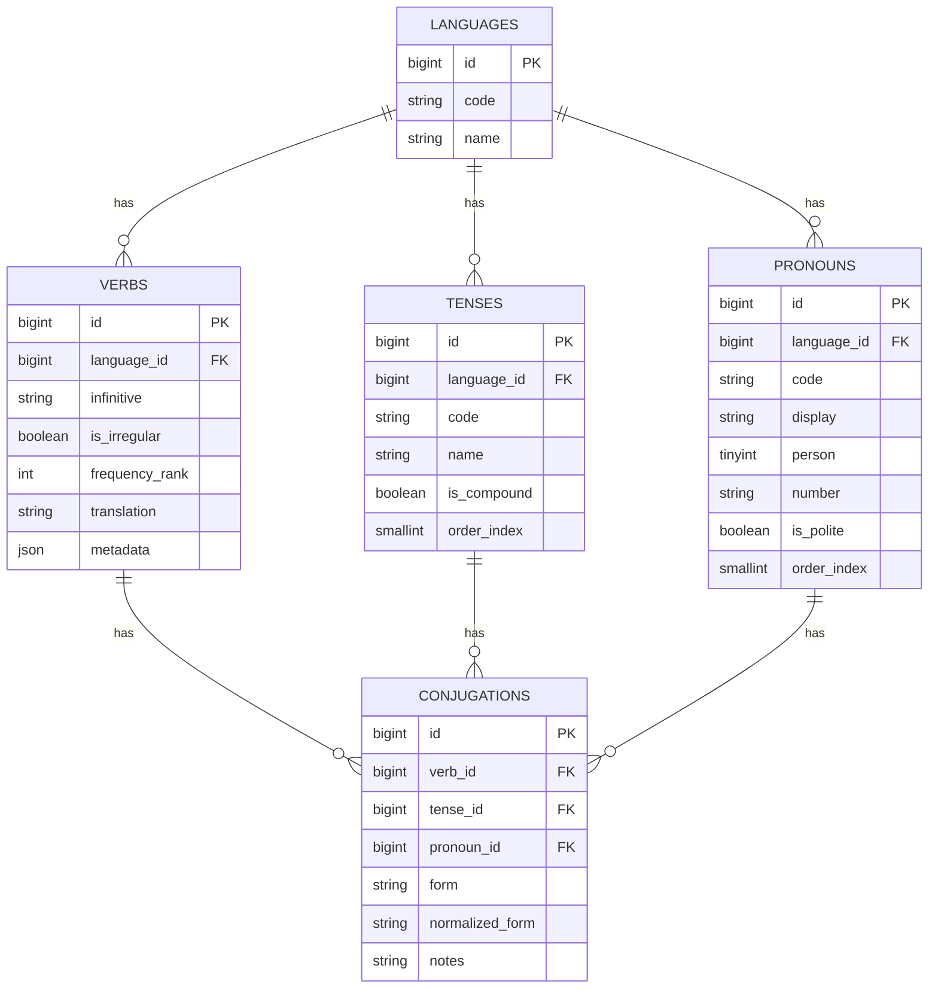

# Conjugations Schema (ERD and Fields)

This document describes the multi-language conjugation schema to support the VerbConjugationSlotMachine game and other verb-related features.

## Entities

- Verbs (`verbs`)
  - id (PK)
  - language_id (FK → languages.id)
  - infinitive (string)
  - is_irregular (bool)
  - frequency_rank (int, nullable)
  - translation (string, nullable)
  - metadata (json, nullable) — language-specific data (e.g., separable prefixes)
  - UNIQUE(language_id, infinitive)
  - INDEX(language_id, frequency_rank)

- Tenses (`tenses`)
  - id (PK)
  - language_id (FK → languages.id)
  - code (string) — canonical code, e.g., `de.pres.ind`, `es.pret.ind`, `en.past.simp`
  - name (string) — UI label
  - is_compound (bool)
  - order_index (smallint)
  - UNIQUE(language_id, code)
  - INDEX(language_id, order_index)

- Pronouns (`pronouns`)
  - id (PK)
  - language_id (FK → languages.id)
  - code (string) — canonical key, e.g., `ich`, `yo`, `i`
  - display (string) — display label
  - person (tinyint) — 1, 2, 3
  - number (string) — `sg`|`pl`
  - is_polite (bool)
  - order_index (smallint)
  - UNIQUE(language_id, code)
  - INDEX(language_id, order_index)

- Conjugations (`conjugations`)
  - id (PK)
  - verb_id (FK → verbs.id)
  - tense_id (FK → tenses.id)
  - pronoun_id (FK → pronouns.id)
  - form (string) — canonical conjugated form
  - normalized_form (string, nullable) — lowercase, accent-stripped for exact-but-accent-insensitive matching
  - notes (string, nullable)
  - UNIQUE(verb_id, tense_id, pronoun_id)
  - INDEX(normalized_form)

## Normalization

The `Conjugation` model sets `normalized_form` from `form` using a mutator:
- Lowercase via `mb_strtolower`
- Strip diacritics via `iconv(... 'ASCII//TRANSLIT//IGNORE')`
- Remove remaining non-alphanumeric punctuation (except spaces, dashes, apostrophes)

This supports user input comparisons that are exact in spelling modulo accents.

## Example Tense Codes

- German: `de.pres.ind`, `de.perf.ind`, `de.praet.ind`
- Spanish: `es.pres.ind`, `es.pret.ind`, `es.fut.simp`
- English: `en.pres.simp`, `en.past.simp`, `en.fut.simp`

## ERD (Mermaid)

## Notes

- `normalized_form` is nullable to support legacy/import scenarios; it will be populated automatically when `form` is set.
- For JSON-driven import, we will upsert `verbs`, `tenses`, `pronouns` and insert/update `conjugations` using `(verb_id, tense_id, pronoun_id)` as a composite key.
